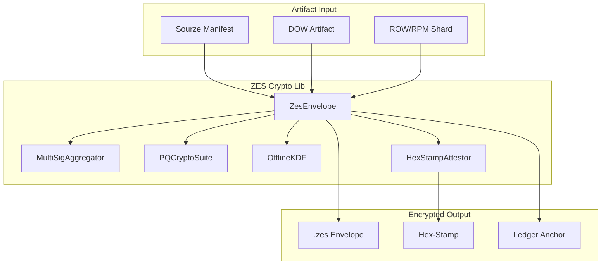

# ZES Crypto Lib Architecture

## Overview

`zes-crypto-lib` is the **Cryptographic Layer** of the Sovereign Spine, providing quantum-safe encryption and multi-DID envelope support for all ALN artifacts.

## Architecture Diagram

Key Design Principles
Quantum-Safe - NIST-approved post-quantum algorithms
Multi-DID - No single point of compromise
Offline-First - Key derivation from snapshots
Algorithm-Agile - Future-proof cryptographic negotiation
Attested - Hex-stamp on every envelope

Cryptographic Suites

[table-938783ed-52e4-4c3b-8eab-63cbd3186863.csv](https://github.com/user-attachments/files/25728283/table-938783ed-52e4-4c3b-8eab-63cbd3186863.csv)
Suite,Algorithm,Purpose,Status
Kyber-1024,CRYSTALS-Kyber,Key Encapsulation,✅ Active
Dilithium,CRYSTALS-Dilithium,Digital Signatures,✅ Active
SPHINCS+,SPHINCS+,Stateless Signatures,✅ Active
BLS12-381,BLS,Threshold Aggregation,✅ Active

Security Properties
Confidentiality - Quantum-safe encryption
Integrity - Hex-stamp attestation
Authenticity - Multi-DID signatures
Availability - Offline key derivation
Non-Repudiation - Ledger-anchored proofs
Document Hex-Stamp: 0x4d5e6f7a8b9c0d1e2f3a4b5c6d7e8f9a0b1c2d3e4f5a6b7c8d9e0f1a2b3c4d5e
Last Updated: 2026-03-04
